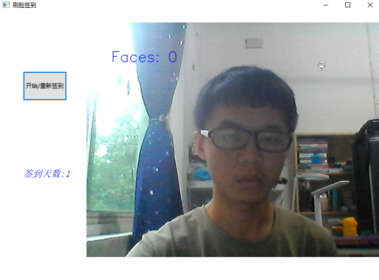

# WorkAttendanceSystem    
一个基于opencv人脸识别的员工考勤系统，作者某双一流A类大学里的~~一流~~学生，写于2018/09/，python课设期间。  

|作者|[inspurer](https://inspurer.github.io/2018/06/07/%E6%9C%88%E5%B0%8F%E6%B0%B4%E9%95%BF%E7%9A%84%E7%94%B1%E6%9D%A5/#more)|
|:---:|:---:|
|QQ|2391527690|
|个人博客|[https://inspurer.github.io/](https://inspurer.github.io/)|
-----------------------------------------------------------------------------------    

# :dolphin:V1.0    
## 项目结构    
mainui.py是主界面，调用face_img_register.py和face_recognize_punchcard.py   
其中face_img_register.py是录入人脸信息，face_recognize_punchcard.py是刷脸考勤
face_feature_storage.py属于鸡肋文件，没什么用，舍不得删，毕竟有点参考价值。   
face_recognize_punchcard_lib.py和face_recognize_punchcard.py本质上差不多，
但是前者是给face_img_register.py专有的依赖。防止录入两个同样的人脸建不同数据库的风险。   

## 运行效果   
### 1. 主界面   
   
### 2. 人脸录入   
    
### 3. 刷脸考勤    
这是通宵后的我

其余的就不多做展示了，有什么问题欢迎2391527690@qq.com联系      

-----------------------------------------------------------------------------------
## 更新     
### 2018/9/23更新
mainui.py-->myapp.py   
face_recognize_punchcard_lib.py等鸡肋文件放到useless文件夹里    
运行效率显著提高   

### 2018/9/25更新    
解决同步性问题，新录入的人脸能立即被识别    
代码的运行速度少许下降    

# :dolphin:V2.0   
## 1. 全新设计的UI,更人性化的操作    

这也是通宵后的我     
## 2. 数据更加安全，用户不可见
人脸数据和签到日志全部保存在inspurer.db数据库文件里，更加安全；而且对人脸数据进行了压缩，更加小巧。   
## 3. 注意事项       
1. 打开摄像头时请左右晃动一下人脸，确保人脸识别开始。   
2. 人脸识别时做了拒绝处理，多张人脸时，只取距离屏幕最近的人脸。      
3. `新建录入`时会自动录入十张人脸照片，也可手动点击`完成录入`立即完成，之后就会计算人脸数据并存储到数据库中，    
左边的信息栏会有相应的信息打印。   
4. `开始签到`后，如不点击`结束签到`,就会一直对屏幕前的人脸进行签到，签到状态分三种,未识别的人脸，签到成功，   
签到成功但是迟到了(9.00后签到),重复签到(此时签到日志不会写入到数据库。         
5. 为确保程序稳定性，每一个菜单里的按钮尽量成对操作。    

-----------------------------------------------------------------------------------
****Thanks for your attention;can you fork it if helping you?   
CopyRight 2391527690@qq.com;send me for more****

# git clone下载仓库速度过慢的问题请参考:[CSDN博客](https://blog.csdn.net/ygdxt/article/details/82825013)

# [源代码地址](https://github.com/inspurer/WorkAttendanceSystem)   

