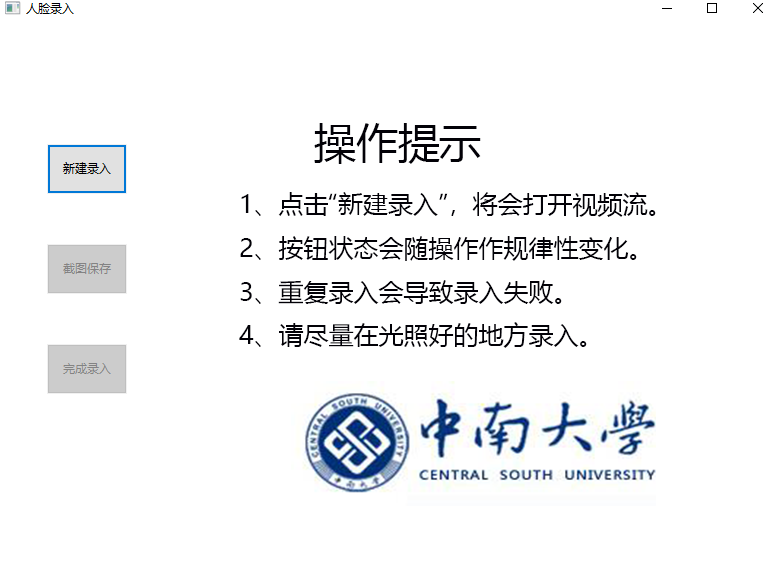
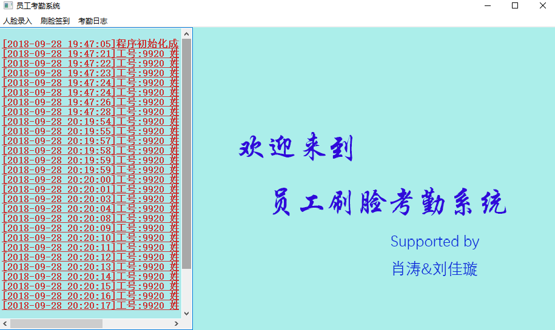
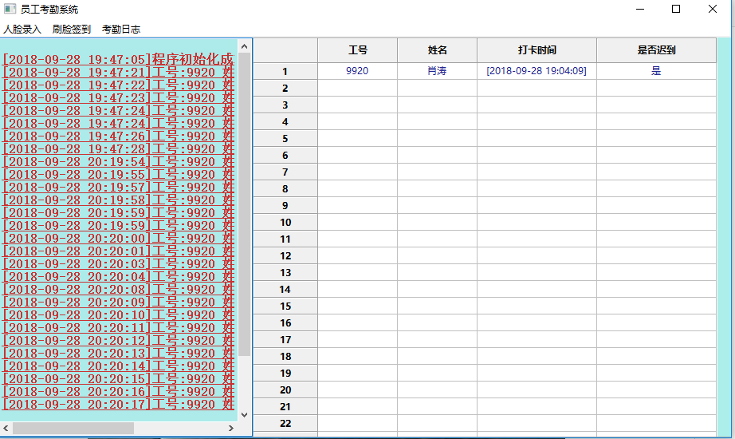
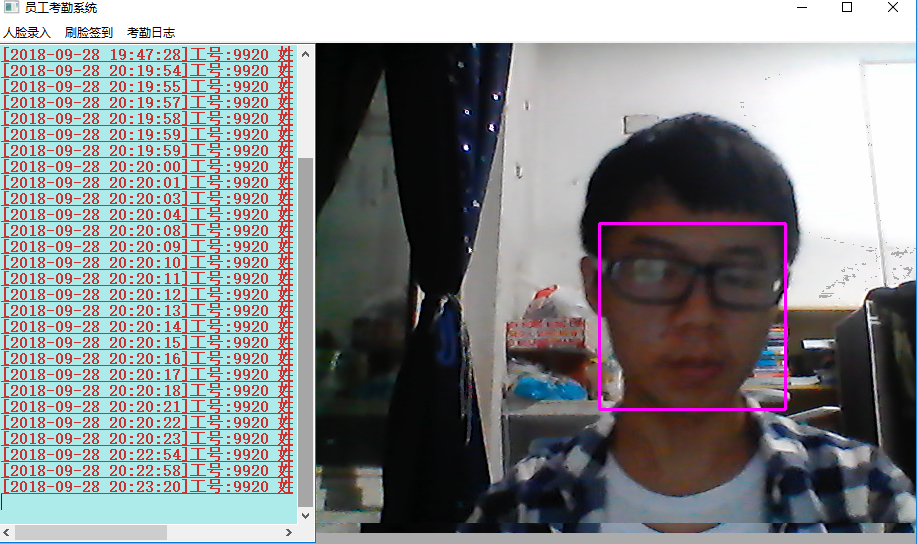

## 项目及作者说明

 

  </a>
  </a>
  </a>
  </a>
 

 
 
 一个基于 Opencv、dlib 人脸识别的员工考勤系统，作者某双一流A类大学里的~~一流~~学生，写于2018/09/，Python 学习期间。  
 
 
|作者|[inspurer](https://inspurer.github.io/2018/06/07/%E6%9C%88%E5%B0%8F%E6%B0%B4%E9%95%BF%E7%9A%84%E7%94%B1%E6%9D%A5/#more)|
|:---:|:---:|
|QQ交流群|[861016679](https://jq.qq.com/?_wv=1027&k=5Js6sKS)|
|个人博客|[https://inspurer.github.io/](https://inspurer.github.io/)|

## 开源版及商业版说明

||开源版|商业版|
|:---:|:---:|:---:|
|人脸录入|支持|支持|
|上班刷脸签到|支持|支持|
|下班刷脸签到|不支持|支持|
|自定义签到时间|不支持|支持|
|考勤日志展示（电子表格）|支持|支持|
|考勤日志展示（网页表格）|不支持|支持|
|考勤日志自定义导出|不支持|支持|

>商业版源代码和 exe 均未公开，如需商业版在**微信公众号：月小水长**后台私戳我，伸手党勿扰。

------------------------------------------------------------------------------------

## QuickStart

<ol>
 <li>IDE：Pycharm</li>
 <li>环境：Python 3.5+</li>
 <li>第三方包：pip install -r requirements.txt</li>
</ol>
  
# V1.0

## 项目结构    

~~mainui.py是主界面，调用face_img_register.py和face_recognize_punchcard.py。
face_img_register.py主要实现录入人脸信息功能，face_recognize_punchcard.py实现刷脸考勤。
face_feature_storage.py是在调试过程中产生的文件，可无视 。
face_recognize_punchcard_lib.py和face_recognize_punchcard.py本质上差不多，但是前者是给face_img_register.py库依赖。    
防止录入两个同样的人脸建不同数据库的风险.~~

## 运行效果   
### 1. 主界面   

   

### 2. 人脸录入   

    

### 3. 刷脸考勤   

>图片涉及个人隐私，已被我删除。

## 更新     
### 2018/9/23更新

>mainui.py-->myapp.py   
>face_recognize_punchcard_lib.py等鸡肋文件放到useless文件夹里    
>运行效率显著提高   

### 2018/9/25更新    

>解决同步性问题，新录入的人脸能立即被识别    
>代码的运行速度少许下降    
----------------------------------------------------------------------------------------------

# V2.0

## 重构代码   

>老师看了我的V1.0版本后给的建议，

>第一，不能有太多弹窗界面，一些操作应该放到工具栏中，而不是弹窗实现；

>第二，数据保存在csv文件容易被窃读，应该保存到数据库里；

>第三，显示考勤日志时应该由自己的电子表格实现而不是直接调用excel。

>基于以上的问题和算法优化的需要，我把代码优化成了V2.0，同时所以的代码合在一个WorkAttwndanceSystem.py文件里，就人脸识别这部分代码而言，提高了代码复用度

## 1. 全新设计的UI,更人性化的操作    

>这是通宵后的我

     
## 2. 数据更加安全，用户不可见
>人脸数据和签到日志全部保存在inspurer.db数据库文件里，更加安全；而且对人脸数据进行了压缩，更加小巧。   
## 3. 注意事项   
<ol>
<li>打开摄像头时请左右晃动一下人脸，确保人脸识别开始.</li>
<li>人脸识别时做了拒绝处理，多张人脸时，只取距离屏幕最近的人脸.</li>
<li>`新建录入`时会自动录入十张人脸照片，也可手动点击`完成录入`立即完成，之后就会计算人脸数据并存储到数据库中,左边的信息栏会有相应的信息打印.</li?
<li>`开始签到`后，如不点击`结束签到`,就会一直对屏幕前的人脸进行签到，签到状态分三种,未识别的人脸,签到成功,签到成功但是迟到了（9.00后签到）,重复签到(此时签到日志不会写入到数据库.</li>         
<li>为确保程序稳定性，每一个菜单里的按钮尽量成对操作.</li>  
</ol>

-----------------------------------------------------------------------------------

# 后话

## git clone下载仓库速度过慢的问题请参考:[CSDN博客](https://blog.csdn.net/ygdxt/article/details/82825013)

## 有关代码的详细解释和设计实现过程请参考:[微信公众号:月小水长](https://mp.weixin.qq.com/s/6BxBQoSwzhI6WooKMuTkNA)  

## V2.0版本已打包,可直接下载运行,文件过大，只上传百度云  

[链接：https://pan.baidu.com/s/1aIA6AhTB8LVESSAN5jgDjQ 提取码：l7or](https://pan.baidu.com/s/1aIA6AhTB8LVESSAN5jgDjQ) 

## 更新计划

<ol>
 <li>改进特征提取算法，提高识别精度。</li>
 <li>采用 PyQt5 重构整个界面。</li>
 <li>改用 Java 语言，移植到 Android 平台上。</li>
</ol>

## 赞赏  
  

